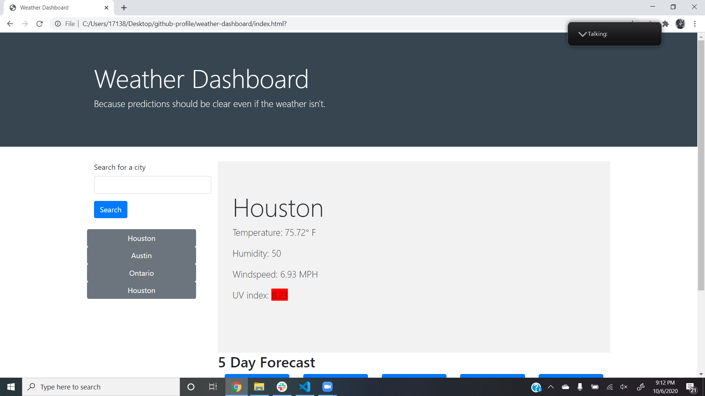

# weather-dashboard

When packing for a trip, knowing the weather for the area you are going is vital.  The Weather Dashboard provides travelers with up to date information for any city in the world and provides a 5 day outlook to help any traveler plan for stays of varying leangths.

## Technology Used
This application uses the open API openweathermap to provide the most up to date data for any city.  javascript, jquery, css, bootstrap, and html all work together to give the website a dynamic and pleasing appearance.

## Features
* Search history bar
* 5 day forecast to provide a snapshot of the days ahead
* Current weather in anlarge, easy to read display
* Color coding for the UV index, providing easy to process information upon first glance
* Icons in the five day forecast to provide at a glance information

